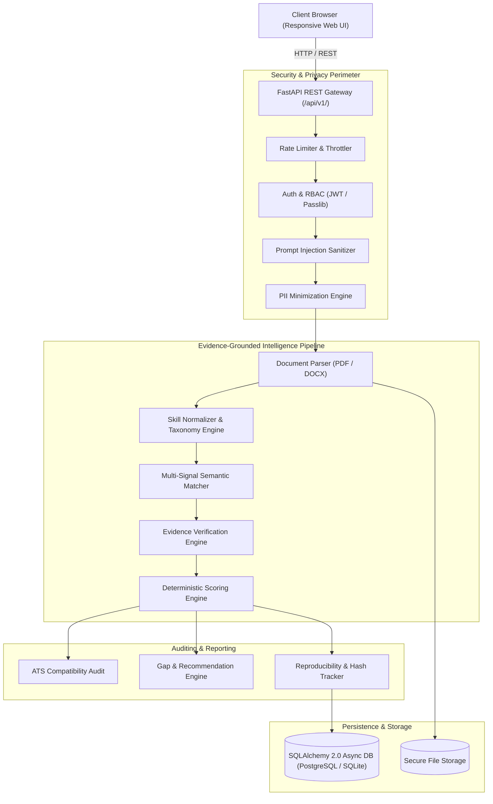
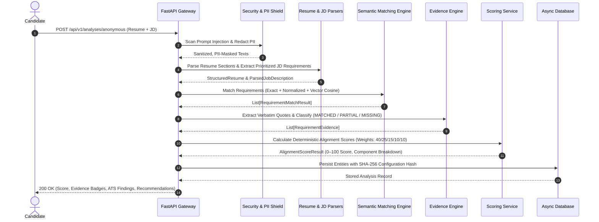
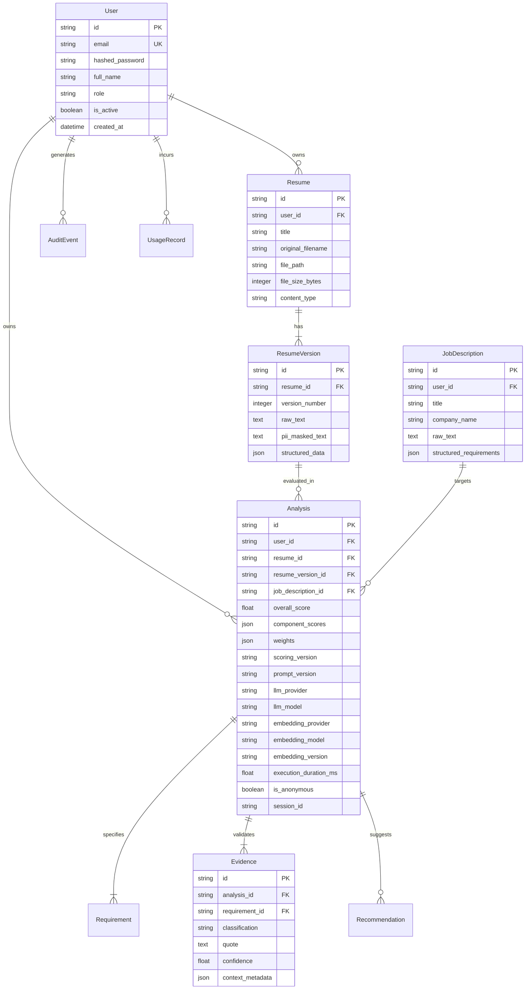

# IRecruit — Technical Architecture Blueprint

## 1. System Overview & Philosophy

**IRecruit** is structured as an enterprise-grade **Modular Monolith**. It balances high cohesion within domain modules with loose coupling across system boundaries.

The core philosophical distinction of IRecruit is **deterministic evidence grounding**:
- Machine Learning and Vector Embeddings are utilized to discover candidate evidence.
- Mathematical scoring algorithms calculate objective alignment percentages.
- LLMs provide natural language explanations and targeted phrasing optimizations.
- **The LLM never sets the score, never invents missing competencies, and never operates on raw un-sanitized user input.**

---

## 2. End-to-End Analysis Pipeline

When an analysis is requested, the system executes an automated 7-stage pipeline:

---

## 3. Database Schema & Entity-Relationship Model

The persistence layer enforces strict referential integrity, foreign key cascades, and ownership partitioning:

---

## 4. Provider-Agnostic AI Architecture

Domain services depend strictly on abstract provider protocols (`BaseLLMProvider` and `BaseEmbeddingProvider`). This architecture decouples business logic from specific vendors:

- **Factory Pattern**: `get_llm_provider()` and `get_embedding_provider()` resolve implementations dynamically based on environment configuration (`LLM_PROVIDER=openai`, `LLM_PROVIDER=ollama`, or `LLM_PROVIDER=mock`).
- **Zero API Key Leakage**: Keys are read strictly via Pydantic settings from isolated environment variables.
- **Circuit Breaking & Fallbacks**: Graceful fallback to deterministic heuristics if an external provider suffers network timeouts or rate limits.

---

## 5. Security Posture & Threat Model (STRIDE)

| Threat Category | Specific Threat | System Mitigation |
| :--- | :--- | :--- |
| **Spoofing** | Unauthorized access to user reports | JWT Bearer authentication with 30-minute expiry; session validation. |
| **Tampering** | Prompt injection altering alignment scores | Input sanitization using `PromptInjectionDetector`; deterministic scoring bypassing LLM outputs. |
| **Repudiation** | Denying analysis deletion or data access | Immutable `AuditEvent` logs tracking user ID, IP address, timestamp, and resource ID. |
| **Information Disclosure** | Leakage of candidate PII in logs or LLM payloads | Automated `PIIService` redaction of SSNs, credit cards, phones, and addresses prior to external tokenization. |
| **Denial of Service** | Resource exhaustion via massive file uploads or rapid requests | Strict 10MB file limit; MIME sniffing; sliding-window token bucket `RateLimiter`. |
| **Elevation of Privilege** | Cross-tenant analysis manipulation | Row-level ownership verification (`verify_analysis_ownership`) on all read/write endpoints. |

---

## 6. Reproducibility & Model Tracking

Every generated analysis calculates a deterministic SHA-256 configuration signature:
$$\text{Signature} = \text{SHA256}(\text{provider} : \text{model} \parallel \text{embedder} : \text{embedder\_model} : \text{version} \parallel \text{prompt\_version} \parallel \text{scoring\_version})$$

This signature guarantees that any audit can verify the exact configuration that produced a historical report.
